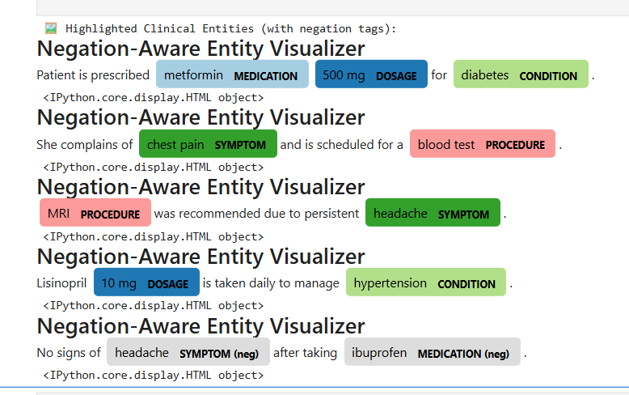

# 🧠 Clinical NER with Negation & Section Detection

This project demonstrates a beginner-friendly, rule-based Clinical Named Entity Recognition (NER) pipeline using **spaCy**, without relying on external libraries like medspaCy. It includes **negation detection**, **section header parsing**, and **visualization** of clinical entities.

# 🧠 Clinical NER with spaCy + EntityRuler

This project demonstrates a clinical Named Entity Recognition (NER) pipeline using spaCy and EntityRuler with additional features like negation detection and section classification.



✅ No MedSpaCy required  
✅ Fully customizable  
✅ Portfolio & beginner-friendly


## 📅 Use Case

Extract structured clinical information from medical notes for annotation, audit, or downstream analysis:

* Identify entities like medications, dosages, conditions, procedures, and symptoms
* Detect negated clinical findings (e.g. "no chest pain")
* Associate entities with clinical sections (e.g. HPI, PLAN)

---

## 📈 Output Example

| Original Text                                   | Entity    | Label      | Negated | Section |
| ----------------------------------------------- | --------- | ---------- | ------- | ------- |
| No signs of headache after taking ibuprofen.    | headache  | SYMPTOM    | True    | UNKNOWN |
| No signs of headache after taking ibuprofen.    | ibuprofen | MEDICATION | True    | UNKNOWN |
| MRI was recommended due to persistent headache. | MRI       | PROCEDURE  | False   | UNKNOWN |

---

## 📊 Pipeline Steps

1. **Rule-based EntityRuler** with spaCy for clinical terms
2. **Custom negation detector** for context ("no headache")
3. **Regex-based section detection** (e.g., HPI, MEDICATIONS, PLAN)
4. **DisplaCy visualizer** with negation markers
5. **CSV export** and Pandas display

---

## 🚀 How to Run

1. Clone or download this repo
2. Set up a virtual environment:

```bash
python -m venv clinical-nlp-env
clinical-nlp-env\Scripts\activate  # On Windows
```

3. Install requirements:

```bash
pip install -r requirements.txt
```

4. Launch Jupyter Notebook:

```bash
jupyter notebook
```

5. Open `clinical_ner_template_expanded.ipynb`

---

## 🔹 Files

* `clinical_ner_template_expanded.ipynb`: Main notebook
* `clinical_ner_with_negation_and_section.csv`: Structured output
* `clinical_ner_visual_output.png`: Visualization (optional)

---

## 🔍 Sample Visual

Clinical entities colored by label and negation status:

```
No signs of headache SYMPTOM (neg) after taking ibuprofen MEDICATION (neg)
```

---

## 🌟 Author

**Samuel Njeru Ngari**
Aspiring Clinical NLP Annotation & QA Specialist

---

## 🔗 Connect

* [LinkedIn Profile](https://www.linkedin.com/in/samuel-n-ngari)
* [GitHub Profile](https://github.com/samuelnjerungari)

---

## 🎯 Future Enhancements

* Integration with **scispaCy** or **medspaCy**
* Annotation Quality Audits (QA)
* Real clinical corpora (MIMIC, i2b2, etc.)
* Upload as a Hugging Face Space or Streamlit app

---


